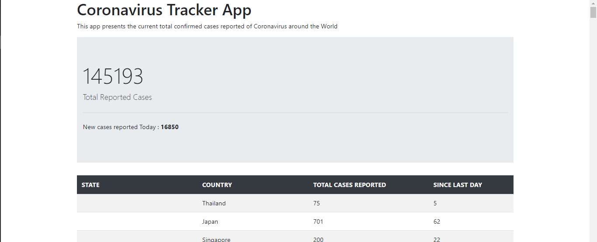
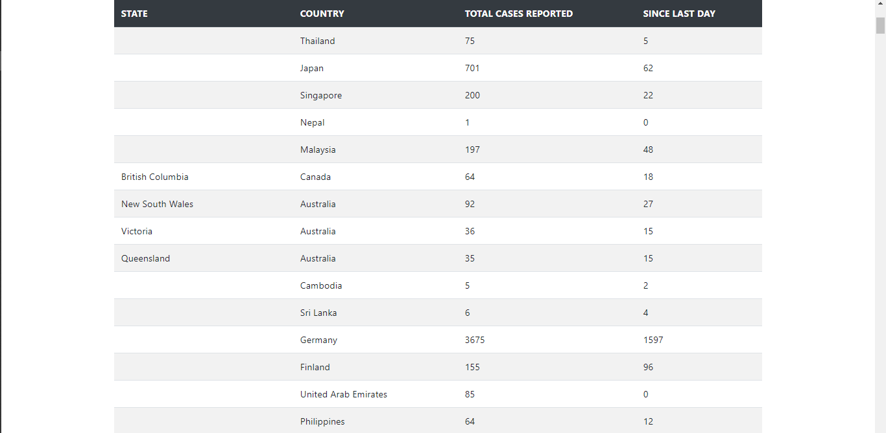

# Coronavirus-Tracker-Using-SpringBoot

## Introduction

The coronavirus sweeping across the world has become a pandemic as reported lately by the World Health Organization. Therefore, it is very important to keep up with the news about this virus, that's why I decided to create a Coronavirus Tracker to keep us updated to the news about Coronavirus confirmed cases' reporting. To do so, I created this Web app using this Data source : **Novel Coronavirus (COVID-19) Cases, provided by JHU CSSE** 

In this app, I extracted the data from the Data source and displayed it in a nice format easy to read, and it loads the data every hour to update the app.
 
## Dev Tools 

- **Java Spring Boot 2.2.5**
- **JDK 11**
- **Bootstrap 4.4.1**
- **Thymeleaf** as a template engine

## Screenshots

